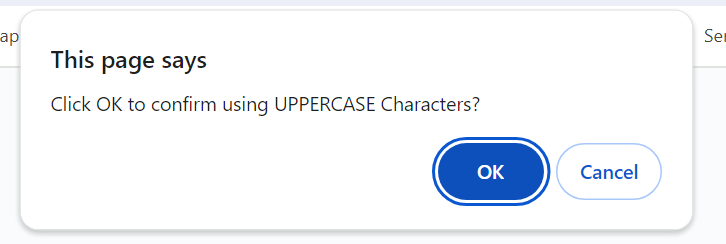

# Bootcamp Challenge Week Three - Password Generator

## Description

Purpose: to test my knowledge of javascript.

in this project i was given the html and css code starter code, and no javascript code.Tthe task was to create javascript code that enables employees to generate random passwords based on criteria that they've selected, and dynamically display the generated password within the HTML and CSS elements

During the project I learnt the importance of the parseInt() function to ensure entered number is parsed correctly as a number instead of a string

# User Story

```
AS AN employee with access to sensitive data
I WANT to randomly generate a password that meets certain criteria
SO THAT I can create a strong password that provides greater security
```


## Acceptance Criteria

```
GIVEN I need a new, secure password
WHEN I click the button to generate a password
THEN I am presented with a series of prompts for password criteria
WHEN prompted for password criteria
THEN I select which criteria to include in the password
WHEN prompted for the length of the password
THEN I choose a length of at least 8 characters and no more than 128 characters
WHEN asked for character types to include in the password
THEN I confirm whether or not to include lowercase, uppercase, numeric, and/or special characters
WHEN I answer each prompt
THEN my input should be validated and at least one character type should be selected
WHEN all prompts are answered
THEN a password is generated that matches the selected criteria
WHEN the password is generated
THEN the password is either displayed in an alert or written to the page
```

## Usage

The completed project can be viewed via GitHub pages as below.
https://mlewis89.github.io/wk3-PasswordGenerator/

GitHub repository
https://github.com/mlewis89/wk3-PasswordGenerator/

## Screen Shots of Completed Challenge





## Installation

The project files are within the /root folder of this repo, please explore index.html, ./asests/style.css. and ./assets/js/script.js


## Credits

Monash University Full Stack Coding bootcamp

## License

Please see MIT Licence within repo

---
